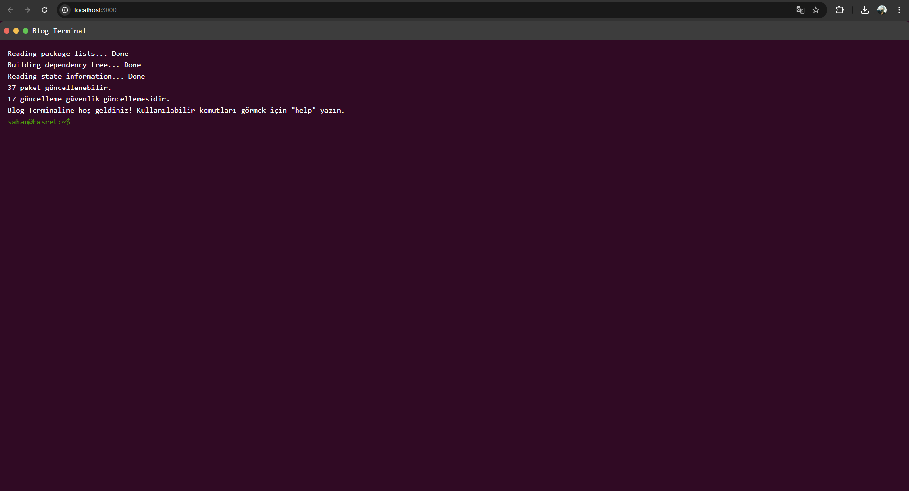
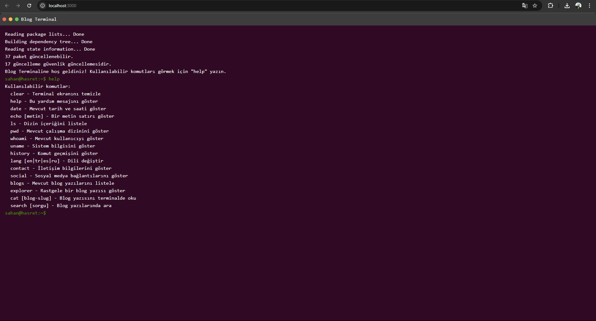
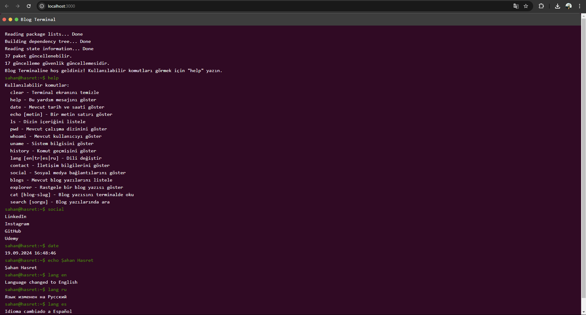

# Çok Dilli Blog Terminal Uygulaması

[]

 
 
 

**Screenshoots:**

---

## Türkçe

### Özellikler ve Komutlar

-   **Dil Desteği**: Uygulama, İngilizce (en), Türkçe (tr), İspanyolca (es) ve Rusça (ru) dahil olmak üzere dört dilde kullanılabilir. Kullanıcılar `lang [dil-kodu]` komutu ile dil değiştirebilirler.
-   **Temel Komutlar**:
    -   `clear`: Terminal ekranını temizler.
    -   `help`: Mevcut komutların bir listesini gösterir.
    -   `date`: Geçerli tarih ve saati gösterir.
    -   `echo [metin]`: Girilen metni yazar.
    -   `ls`: Mevcut dizindeki dosya ve klasörleri listeler.
    -   `pwd`: Mevcut dizin yolu gösterilir.
    -   `whoami`: Aktif kullanıcı adını gösterir.
    -   `uname`: Sistem bilgilerini gösterir.
    -   `history`: Girilen komut geçmişini listeler.
-   **İletişim ve Sosyal Medya**:
    -   `contact`: Kullanıcının iletişim bilgilerini gösterir.
    -   `social`: Sosyal medya linklerini listeler.
-   **Blog Yönetimi**:
    -   `blogs`: Mevcut blog yazılarını listeler.
    -   `cat [blog-slug]`: Belirtilen blog yazısını terminalde açar.
    -   `search [sorgu]`: Blog yazılarında arama yapar.
    -   `explorer`: Rastgele bir blog yazısını gösterir.

### Çalıştırma ve Yayınlama

#### Geliştirme Ortamı Kurulumu

1.  **Node.js ve npm Kurulumu**: React ve Next.js kullanıldığı için, sisteminizde Node.js ve npm'nin yüklü olması gerekir.
2.  **Proje Dosyalarını İndirme**: Projeyi yerel makinenize klonlayın veya indirin.
3.  **Bağımlılıkları Yükleme**: Terminali açın ve proje dizinine gidin. `npm install` komutunu çalıştırarak gerekli kütüphaneleri yükleyin.

#### Lokalde Çalıştırma

Projeyi lokalde çalıştırmak için, proje dizininde terminal üzerinden `npm run dev` komutunu çalıştırın. Bu, Next.js geliştirme sunucusunu başlatır ve uygulamayı `localhost:3000` adresinde erişime açar.

#### Vercel ile Yayınlama

1.  **Vercel Hesabı Oluşturma**: Vercel.com üzerinden bir hesap oluşturun.
2.  **Projeyi Vercel ile Bağlama**: Vercel dashboard üzerinden "New Project" seçeneğini kullanarak GitHub, GitLab veya Bitbucket üzerindeki projenizi Vercel ile bağlayın.
3.  **Proje Ayarlarını Yapılandırma**: Deployment ayarlarını yapılandırın. Genellikle Vercel, Next.js projeleri için otomatik yapılandırmalar sunar.
4.  **Projeyi Yayınlama**: Ayarlarınızı kaydettikten sonra, projenizi yayınlamak için "Deploy" butonuna tıklayın. Vercel, projenizi otomatik olarak build edip, online bir URL üzerinden yayınlar.

#### Linux Sunucusunda Yayınlama

1.  **Sunucu Hazırlığı**: Bir Linux sunucusuna sahip olmanız ve bu sunucuya SSH ile erişebilmeniz gerekir.
2.  **Node.js Kurulumu**: Sunucuya Node.js ve npm yükleyin.
3.  **Proje Dosyalarını Yükleme**: Projeyi sunucunuza yükleyin.
4.  **Bağımlılıkları Yükleme ve Build İşlemi**: Proje dizininde `npm install` ve ardından `npm run build` komutlarını çalıştırın.
5.  **PM2 ile Uygulamayı Çalıştırma**: PM2 gibi bir process manager kullanarak uygulamayı başlatın: `pm2 start npm --name "blog-terminal" -- run start`.

Bu adımlarla projenizi başarıyla çalıştırabilir ve çeşitli platformlarda yayınlayabilirsiniz.

---

## English

### Features and Commands

-   **Language Support**: The application is available in four languages: English (en), Turkish (tr), Spanish (es), and Russian (ru). Users can change the language with the `lang [language-code]` command.
-   **Basic Commands**:
    -   `clear`: Clears the terminal screen.
    -   `help`: Displays a list of available commands.
    -   `date`: Displays the current date and time.
    -   `echo [text]`: Outputs the entered text.
    -   `ls`: Lists the files and folders in the current directory.
    -   `pwd`: Displays the current directory path.
    -   `whoami`: Prints the active username.
    -   `uname`: Prints system information.
    -   `history`: Lists the command history.
-   **Contact and Social Media**:
    -   `contact`: Displays the user's contact information.
    -   `social`: Lists social media links.
-   **Blog Management**:
    -   `blogs`: Lists all available blog posts.
    -   `cat [blog-slug]`: Opens the specified blog post in the terminal.
    -   `search [query]`: Searches for blog posts based on a query.
    -   `explorer`: Displays a random blog post.

### Running and Deploying

#### Development Environment Setup

1.  **Install Node.js and npm**: Since this project uses React and Next.js, you'll need to install Node.js and npm on your system.
2.  **Download Project Files**: Clone or download the project files to your local machine.
3.  **Install Dependencies**: Open your terminal, navigate to the project directory, and run `npm install` to install the required packages.

#### Running Locally

To run the project locally, navigate to the project directory in your terminal and run `npm run dev`. This will start the Next.js development server and make the application accessible at `localhost:3000`.

#### Deploying on Vercel

1.  **Create a Vercel Account**: Go to Vercel.com and create an account.
2.  **Link the Project to Vercel**: Use the Vercel dashboard to create a "New Project" and link it to your GitHub, GitLab, or Bitbucket repository.
3.  **Configure the Project Settings**: Set up the deployment options. Vercel usually auto-configures Next.js projects.
4.  **Deploy the Project**: Once the settings are saved, click "Deploy" to publish the project. Vercel will build and publish your app automatically with a URL.

#### Deploying on Linux Server

1.  **Server Preparation**: Ensure you have access to a Linux server and can connect via SSH.
2.  **Install Node.js**: Install Node.js and npm on the server.
3.  **Upload Project Files**: Transfer the project files to the server.
4.  **Install Dependencies and Build**: Navigate to the project directory and run `npm install` followed by `npm run build`.
5.  **Run the Application with PM2**: Use PM2, a process manager, to keep the app running: `pm2 start npm --name "blog-terminal" -- run start`.

Following these steps will help you successfully run and deploy your project across various platforms.

---

## Español

### Funciones y Comandos

-   **Soporte de Idiomas**: La aplicación está disponible en cuatro idiomas: Inglés (en), Turco (tr), Español (es) y Ruso (ru). Los usuarios pueden cambiar el idioma con el comando `lang [código-de-idioma]`.
-   **Comandos Básicos**:
    -   `clear`: Limpia la pantalla del terminal.
    -   `help`: Muestra una lista de los comandos disponibles.
    -   `date`: Muestra la fecha y hora actual.
    -   `echo [texto]`: Muestra el texto ingresado.
    -   `ls`: Lista los archivos y carpetas en el directorio actual.
    -   `pwd`: Muestra la ruta del directorio actual.
    -   `whoami`: Imprime el nombre de usuario activo.
    -   `uname`: Muestra información del sistema.
    -   `history`: Lista el historial de comandos.
-   **Contacto y Redes Sociales**:
    -   `contact`: Muestra la información de contacto del usuario.
    -   `social`: Lista los enlaces a redes sociales.
-   **Gestión de Blogs**:
    -   `blogs`: Lista todas las publicaciones de blog disponibles.
    -   `cat [blog-slug]`: Abre la publicación de blog especificada en el terminal.
    -   `search [consulta]`: Busca publicaciones de blog basadas en una consulta.
    -   `explorer`: Muestra una publicación de blog aleatoria.

### Ejecución y Despliegue

#### Configuración del Entorno de Desarrollo

1.  **Instalar Node.js y npm**: Debido a que este proyecto usa React y Next.js, necesitarás instalar Node.js y npm en tu sistema.
2.  **Descargar Archivos del Proyecto**: Clona o descarga los archivos del proyecto en tu máquina local.
3.  **Instalar Dependencias**: Abre tu terminal, navega al directorio del proyecto y ejecuta `npm install` para instalar los paquetes requeridos.

#### Ejecución Local

Para ejecutar el proyecto localmente, navega al directorio del proyecto en tu terminal y ejecuta `npm run dev`. Esto iniciará el servidor de desarrollo de Next.js y hará que la aplicación sea accesible en `localhost:3000`.

#### Despliegue en Vercel

1.  **Crear una Cuenta en Vercel**: Ve a Vercel.com y crea una cuenta.
2.  **Enlazar el Proyecto a Vercel**: Utiliza el tablero de Vercel para crear un "Nuevo Proyecto" y enlázalo a tu repositorio en GitHub, GitLab o Bitbucket.
3.  **Configurar Opciones del Proyecto**: Configura las opciones de despliegue. Vercel usualmente configura automáticamente los proyectos de Next.js.
4.  **Desplegar el Proyecto**: Una vez guardadas las configuraciones, haz clic en "Deploy" para publicar el proyecto. Vercel compilará y publicará tu aplicación automáticamente con una URL.

#### Despliegue en un Servidor Linux

1.  **Preparación del Servidor**: Asegúrate de tener acceso a un servidor Linux y poder conectarte por SSH.
2.  **Instalar Node.js**: Instala Node.js y npm en el servidor.
3.  **Subir Archivos del Proyecto**: Transfiere los archivos del proyecto al servidor.
4.  **Instalar Dependencias y Compilar**: Navega al directorio del proyecto y ejecuta `npm install` seguido de `npm run build`.
5.  **Ejecutar la Aplicación con PM2**: Usa PM2, un gestor de procesos, para mantener la aplicación en funcionamiento: `pm2 start npm --name "blog-terminal" -- run start`.

Siguiendo estos pasos, podrás ejecutar y desplegar tu proyecto de manera exitosa en varias plataformas.

---

## Русский

### Функции и Команды

-   **Поддержка Языков**: Приложение доступно на четырех языках: Английский (en), Турецкий (tr), Испанский (es) и Русский (ru). Пользователи могут изменить язык с помощью команды `lang [код-языка]`.
-   **Основные Команды**:
    -   `clear`: Очищает экран терминала.
    -   `help`: Показывает список доступных команд.
    -   `date`: Показывает текущие дату и время.
    -   `echo [текст]`: Выводит введенный текст.
    -   `ls`: Показывает файлы и папки в текущей директории.
    -   `pwd`: Показывает путь текущей директории.
    -   `whoami`: Показывает имя активного пользователя.
    -   `uname`: Показывает информацию о системе.
    -   `history`: Показывает историю команд.
-   **Контакты и Социальные Сети**:
    -   `contact`: Показывает контактную информацию пользователя.
    -   `social`: Показывает ссылки на социальные сети.
-   **Управление Блогом**:
    -   `blogs`: Показывает все доступные записи блога.
    -   `cat [blog-slug]`: Открывает указанную запись блога в терминале.
    -   `search [запрос]`: Ищет записи блога по запросу.
    -   `explorer`: Показывает случайную запись блога.

### Запуск и Развертывание

#### Настройка Среды Разработки

1.  **Установить Node.js и npm**: Так как этот проект использует React и Next.js, вам нужно установить Node.js и npm на свою систему.
2.  **Скачать Файлы Проекта**: Клонируйте или скачайте файлы проекта на ваш компьютер.
3.  **Установить Зависимости**: Откройте терминал, перейдите в директорию проекта и выполните команду `npm install`, чтобы установить необходимые пакеты.

#### Запуск Локально

Чтобы запустить проект локально, перейдите в директорию проекта в терминале и выполните команду `npm run dev`. Это запустит сервер разработки Next.js, и приложение станет доступным по адресу `localhost:3000`.

#### Развертывание на Vercel

1.  **Создать Аккаунт на Vercel**: Перейдите на Vercel.com и создайте аккаунт.
2.  **Связать Проект с Vercel**: Используйте панель Vercel, чтобы создать "Новый Проект" и связать его с вашим репозиторием GitHub, GitLab или Bitbucket.
3.  **Настроить Проект**: Настройте параметры развертывания. Vercel обычно автоматически конфигурирует проекты Next.js.
4.  **Развернуть Проект**: После сохранения настроек нажмите "Deploy", чтобы опубликовать проект. Vercel автоматически соберет и опубликует ваше приложение с URL.

#### Развертывание на Linux Сервере

1.  **Подготовка Сервера**: Убедитесь, что у вас есть доступ к серверу на Linux и вы можете подключиться через SSH.
2.  **Установить Node.js**: Установите Node.js и npm на сервере.
3.  **Загрузить Файлы Проекта**: Передайте файлы проекта на сервер.
4.  **Установить Зависимости и Собрать Проект**: Перейдите в директорию проекта и выполните команды `npm install`, а затем `npm run build`.
5.  **Запустить Приложение с помощью PM2**: Используйте PM2, менеджер процессов, чтобы поддерживать работу приложения: `pm2 start npm --name "blog-terminal" -- run start`.

Следуя этим шагам, вы сможете успешно запустить и развернуть свой проект на различных платформах.
